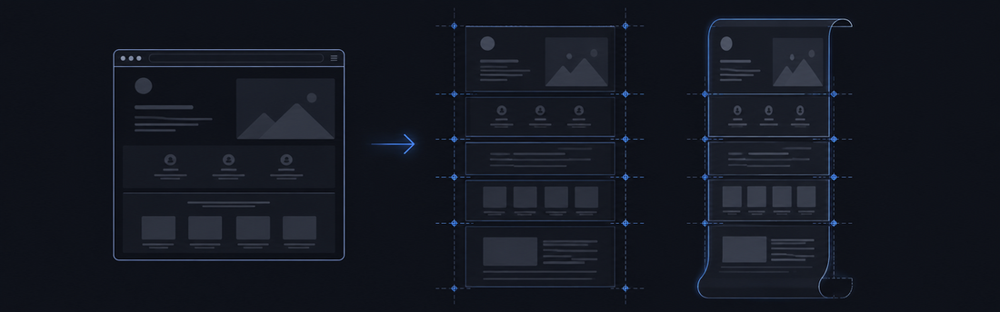
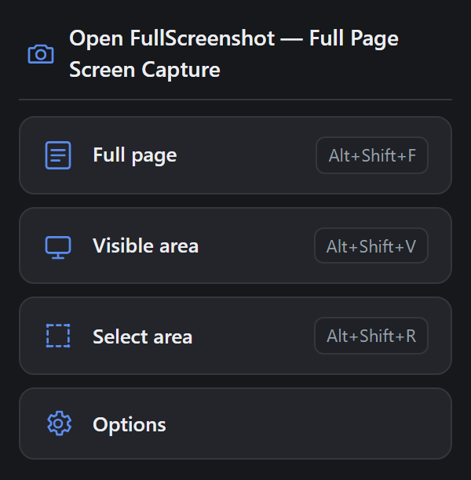
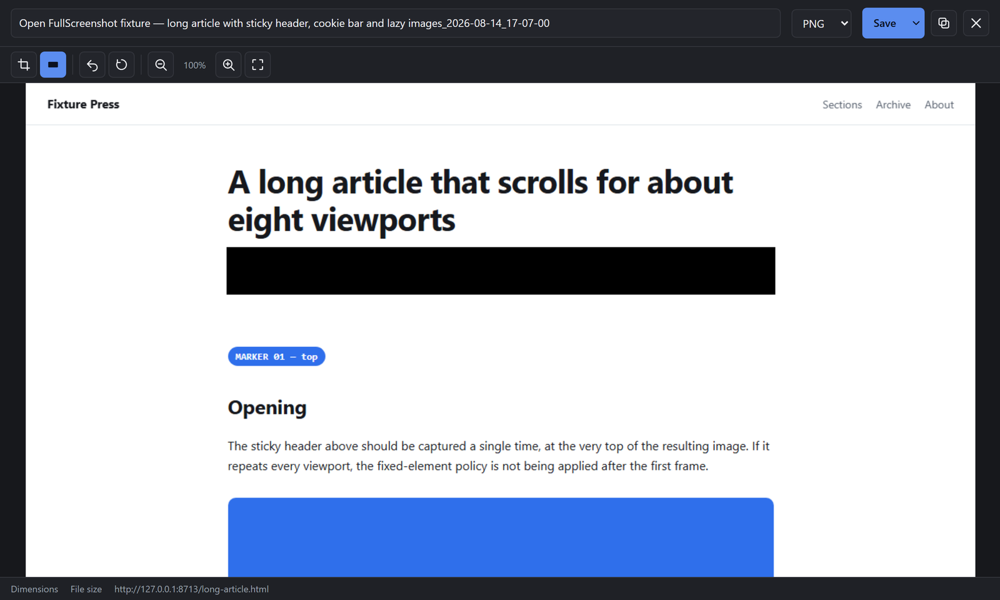
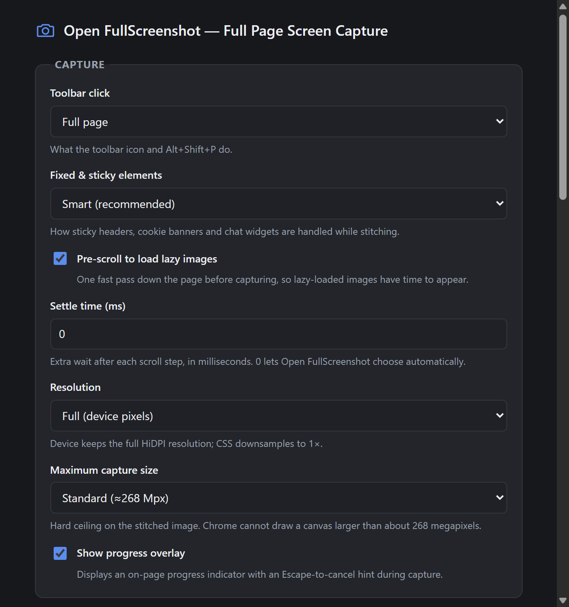
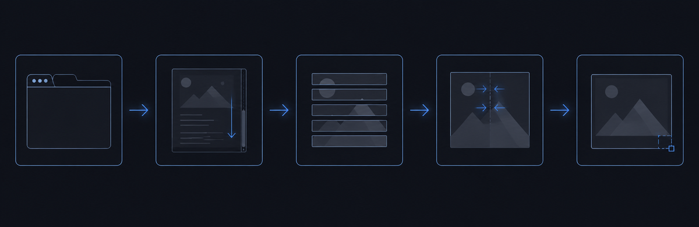

# Open FullScreenshot

A Chrome extension (Manifest V3) that captures a tab as an image or a PDF: the whole scrollable
page, the visible viewport, or an element or region picked with the mouse.

<details>
<summary><strong>Résumé en français</strong></summary>

Open FullScreenshot est une extension Chrome (Manifest V3) qui capture une page web entière
(défilement puis assemblage), la zone visible, ou un élément / une région choisis à la souris via
un seul overlay de sélection. L'image obtenue s'ouvre dans un éditeur intégré (recadrage,
caviardage), puis s'exporte en PNG, JPEG, WebP ou PDF, se copie dans le presse-papiers ou se
glisse-dépose vers un dossier.

Quatre raccourcis clavier, tels que déclarés dans le manifeste : `Alt+Shift+P` action par défaut,
`Alt+Shift+F` page entière, `Alt+Shift+V` zone visible, `Alt+Shift+R` région ou élément.

Deux commandes supplémentaires copient la capture directement dans le presse-papiers, page entière
ou région, sans passer par l'éditeur. Chrome n'accepte que quatre raccourcis suggérés par
extension : elles sont donc livrées sans raccourci et s'assignent dans
`chrome://extensions/shortcuts`. Sans rien assigner, un `Maj`+clic sur un bouton du menu produit le
même résultat. Dans les deux cas, le réglage « Après la capture » n'est modifié que pour cette
capture-là, et rien n'est enregistré.

L'extension fonctionne entièrement hors ligne : aucune requête réseau, aucune télémétrie, aucun
compte. Elle ne déclare **aucune permission d'hôte** — Chrome n'affichera donc jamais
l'avertissement « lire et modifier vos données sur tous les sites web » à son sujet, parce qu'elle
en est incapable. Les réglages restent sur l'appareil (`chrome.storage.local`, jamais
`chrome.storage.sync`).

Il n'existe pas de fiche sur le Chrome Web Store : l'installation se fait en mode développeur,
via « Charger l'extension non empaquetée ». L'interface suit la langue de Chrome en anglais et en
français, avec un choix manuel dans les Options. Implémentation originale, sans lien avec une
extension de capture existante.

</details>

## What it is for

An extension that declares `<all_urls>` earns an install prompt saying it can read and change your
data on every website you visit. Open FullScreenshot declares no host permission at all, so Chrome
never shows that prompt for it. The extension sees a page in the moment you invoke it — toolbar
click, keyboard shortcut, right-click entry — and that access expires when you navigate away.

The rest follows from the same posture. There is no account and no telemetry, and the code makes
no network request of any kind, so scrolling, stitching, encoding and editing all happen inside
your browser and nowhere else. It is written for people who screenshot documentation and bug
reports all day and would rather read the source than a privacy policy. The 22 files under `src/`
— fourteen JavaScript, four CSS, four HTML, roughly 5 200 lines of JavaScript between them — ship
exactly as they were written. There is no build step, so what you read here is what Chrome runs.

Original implementation. Not affiliated with, derived from, or endorsed by any other screenshot
extension.

## Install

There is no build step and nothing to `npm install`. Chrome loads `manifest.json` and `src/`
directly. There is no Chrome Web Store listing either, so loading unpacked is how you install it.

1. Open `chrome://extensions` and turn on **Developer mode** (top right).
2. Click **Load unpacked**.
3. Select the **folder** that directly contains `manifest.json` — the repository root you cloned.

Step 3 is the one that trips people up. The picker will happily let you descend into the folder
and choose a file inside it; what you want is the folder itself, highlighted but not opened. If
the icon does not appear in the toolbar afterwards, pin it from the puzzle-piece menu. Chrome 116
or later.

Whenever you edit a file under `src/`, click the reload icon on the extension's card to pick it up.

`node tools/package.mjs` writes a zip into `dist/` — 30 files, exactly `manifest.json`, `icons/`,
`src/` and `_locales/`, with `docs/`, `tools/`, `test/` and `mcp/` left out. That archive is the
shape a Web Store submission takes; it is not what "Load unpacked" wants, and `dist/` is
gitignored, so a fresh clone will not have one until you build it. The script refuses to write the
zip if `tools/validate.mjs` reports a single failure.

Enabling `file://` access, binding the shortcuts and the manual smoke-test checklist are all in
[`docs/INSTALL.md`](docs/INSTALL.md).

## Usage

**`Alt+Shift+F` captures the whole scrollable page.** One keystroke, no menu, no mode picker.

| Shortcut | What it does |
|---|---|
| `Alt+Shift+P` | Default action — the same thing the toolbar button does, which is a full-page capture until you change it in Options |
| `Alt+Shift+F` | Full page: scroll and stitch |
| `Alt+Shift+V` | Visible area only |
| `Alt+Shift+R` | Region or element, through the selection overlay |

Those are the suggested defaults; rebind any of them at `chrome://extensions/shortcuts`. Chrome
forbids an extension page from linking to that screen, so Options renders the address as selectable
text with a copy button instead of a dead link.

**Two more commands ship unbound, on purpose.**

| Command | What it does |
|---|---|
| Capture the full page and copy it to the clipboard | Full page straight to the clipboard — no editor tab, no file |
| Select an area and copy it to the clipboard | Selection overlay, then straight to the clipboard |

Chrome honours `suggested_key` for at most four commands per extension, and the four above already
spend that budget. A fifth suggested binding would be accepted by the manifest and then quietly
bind nothing, so these two are declared with no key at all: pick your own at
`chrome://extensions/shortcuts`, where they appear alongside the others. They do not change any
setting — each one overrides "After capture" for the single capture it starts.

The same shortcut is available without binding anything: **hold `Shift` while clicking a capture
button in the popup** and that capture goes to the clipboard instead of the editor. The popup says
so under its buttons, and the buttons light up while `Shift` is down.

What that costs, in gestures — a keystroke, a click, or one drag of the selection overlay, on
default settings (captures open in the editor, which does not close itself):

| Journey | Before | Bound copy command | Popup, Shift+click |
|---|---|---|---|
| Full page → file | 3 — `Alt+Shift+F`, **Save**, close the tab | 3 (unchanged) | 3 (unchanged) |
| Full page → clipboard | 3 — `Alt+Shift+F`, **Copy**, close the tab | **1** | 2 — `Alt+Shift+P`, Shift+click |
| Region → clipboard | 4 — `Alt+Shift+R`, select, **Copy**, close the tab | **2** — shortcut, select | 3 |

Setting **After capture** to **Copy to clipboard** in Options reaches 1 gesture too, but it does so
for *every* capture; that is the trade this pair of commands exists to avoid.

The toolbar button behaves the same way as `Alt+Shift+P`. Set **Toolbar click** to **Ask every
time** in Options and it stops capturing on its own, opening a chooser instead:



The shortcut chips on the right come from `chrome.commands.getAll()`, so they report your live
bindings; the manifest's `suggested_key` is only the fallback for a command you have left unbound.
On a default install this panel never appears at all — the button captures the full page without
asking.

The selection overlay is one mode rather than two. Hover an element and it is outlined with its
dimensions in a readout; click it to capture it. Drag instead and you get a free rectangle with
eight resize handles, a live W × H readout, and auto-scroll when the pointer comes within 40 px of
a viewport edge — so a selection can be much taller than the window. Arrows nudge by 1 px,
`Shift`+arrows by 10 px, `Enter` confirms, `Escape` cancels. The overlay lives in a closed shadow
root with inline styles, which is why a site's CSS and its Content-Security-Policy have no effect
on it.

Captures open in a built-in editor tab.



That is a real 1239 × 7678 stitch of `test/fixtures/long-article.html`, shown at 100 % with the
redaction tool active and one bar already applied. Crop, redact, undo, reset, zoom and pan are the
entire toolset; annotation arrows and a text tool are absent and are not planned. Redaction
rasterizes opaque rectangles into the image instead of drawing them over it, so the
covered pixels are gone from every export — including the drag-out payload, which is regenerated
after each edit rather than pointing at the original blob.

From there: save as PNG, JPEG, WebP or PDF, copy to the clipboard, or drag the image straight out
of the tab into a folder or another application. The PDF path writes one page sized to the image,
or slices the capture down A4 or Letter pages. Options can also skip the editor entirely and send
a capture to Downloads, to the clipboard, or to both at once.



Options has five sections. **Capture** is the one above — what the toolbar click does, how fixed
and sticky elements are treated, whether to pre-scroll for lazy images, the settle time after each
scroll step, device versus CSS resolution, the pixel ceiling, and the on-page progress overlay.
**Output** covers what happens once the image exists, the encoding and its quality, whether to open
the Save dialog, and the filename template with a legend of its tokens. **Shortcuts** shows the
current bindings and the address that Chrome will not let the page link to. **Advanced** holds the
theme, the interface language — which follows Chrome's locale in English and French unless you
override it — and a reset-to-defaults button behind a confirmation. **About** is the version
number and a one-line restatement of the privacy position.

## How it works



1. **The active tab** — reached only once you invoke the extension, never before.
2. **The page frozen and scrolled** in viewport-sized steps.
3. **One PNG frame captured per step**, paced against Chrome's quota.
4. **The frames drawn onto a single canvas**, in a hidden offscreen document.
5. **The finished image in the editor**, ready to crop.

The interesting parts are all in steps 2 to 4.

**The scale is measured, not assumed.** After the first frame comes back, the engine computes
`scale = capturedFrameWidth / windowWidth` and uses that number for every placement afterwards.
Trusting `devicePixelRatio` instead would break on page zoom, on OS display scaling, and on
Chrome's own rounding; measuring folds all three into one value that is correct by construction.
The denominator is the *window* width rather than the viewport width, because a captured frame
always spans the whole browser window — the two are identical only when the window itself is the
scroller. With a nested scroller they differ, and using the wrong one scales the entire canvas by
the ratio between them. That was a real bug, and `test/pipeline.mjs` is what caught it.

**The page is put back exactly.** Every mutation goes through one injected `<style id="ofs-freeze">`
element and two data attributes; restoring is a matter of removing them. The page's own inline
styles are never written to, so nothing can be clobbered. Fixed and sticky elements are classified
once by where they sit — top-anchored, bottom-anchored, or neither — and the default `smart` policy
keeps a sticky header in the first frame where it belongs while hiding cookie bars and chat widgets
from every tile, instead of baking them into the middle of the image. Restoration runs in a
`finally`, so `Escape` mid-capture and an outright failure both end the same way: original scroll
offset, animations running, nothing left hidden. `test/e2e.mjs` asserts the DOM comes back
byte-identical.

**Stitching happens in an offscreen document.** A Manifest V3 service worker has no DOM and no
`<canvas>`, so the worker opens a hidden offscreen page, streams each frame to it with source and
destination rectangles, and receives a `blob:` URL back. Capture is paced because
`chrome.tabs.captureVisibleTab` is rate-limited by a quota Chrome does not document per version:
the pacer starts at 60 ms between calls, backs off multiplicatively on every
`MAX_CAPTURE_VISIBLE_TAB_CALLS_PER_SECOND` rejection up to a 1200 ms ceiling, and keeps what it
learned for the life of the service worker.

[`docs/ARCHITECTURE.md`](docs/ARCHITECTURE.md) is the full contract — message names, payload shapes
and the coordinate spaces the tiling maths works in.

## Security and privacy

Seven permissions, and what each one is for:

| Permission | Why it is there |
|---|---|
| `activeTab` | Temporary access to the current tab, granted by your click, shortcut or menu choice and revoked on navigation. It is exactly what `tabs.captureVisibleTab` and on-demand injection need. |
| `scripting` | Injects the page driver and the selection overlay at the moment of capture. |
| `storage` | Your settings, in `chrome.storage.local`. |
| `offscreen` | The hidden document that owns the canvas the tiles are stitched onto. |
| `contextMenus` | The right-click entries, on the page and on the toolbar icon. |
| `downloads` | Writes the finished image or PDF where you tell it to. |
| `clipboardWrite` | Copies the finished image to the system clipboard. |

Four keys are missing from the manifest, and every one of those absences is doing work. Without
`host_permissions` or `<all_urls>`, Chrome will never show the "read and change all your data on
all websites" warning for this extension, because the extension cannot do that. Without
`web_accessible_resources`, no web page can reach anything inside it. Without
`externally_connectable`, no site can open a message channel to it. And without `content_scripts`,
nothing of this extension is running on the pages you never capture.

Beyond the manifest: zero network requests of any kind — no CDN, no web font, no analytics, no
crash reporter, no update ping past the one Chrome performs on the package itself. Settings go to
`chrome.storage.local` and never `chrome.storage.sync`, so they stay on the device rather than
travelling to a signed-in Google account. A capture result lives in memory as a `blob:` URL and is
released when the editor tab closes; nothing reaches the disk unless you save it.

`tools/validate.mjs` fails the build on a network call, on `eval` or `new Function`, on `innerHTML`
with interpolated content, on a host permission and on a web-accessible resource. It does not
check for `externally_connectable`: that key's absence is true today by reading `manifest.json`,
not because a test would catch it coming back.

The permission-by-permission statement, including what is read from the page and why, is in
[`docs/PRIVACY.md`](docs/PRIVACY.md).

## Driving it from a terminal

`mcp/server.mjs` is a stdio server speaking the Model Context Protocol. It offers four tools —
`capture_full_page`, `capture_visible_area`, `capture_region` and `check_setup` — so an MCP client
can capture a URL and get back the absolute path of the file that was written. Nothing is
installed. It opens no port and leaves no daemon behind; Chrome is driven over
`--remote-debugging-pipe` on inherited file descriptors, and deleting the entry from your client's
configuration deletes the server.

Three things are structural rather than temporary, and are better known up front:

- **It drives a separate Chrome profile, signed out of everything.** Chrome 136 and later refuse
  remote debugging on the default user-data-dir, so the server launches its own browser with its
  own profile — roughly 100 MB, under `%LOCALAPPDATA%\OpenFullScreenshot\mcp-profile` on Windows.
  A page behind a login captures as the login wall. Your cookies, extensions and open tabs are not
  involved, and nothing here ever prunes that folder.
- **It runs the capture engine, not the installed extension.** The same `src/**` sources are
  injected into the driven page, so tiling, sticky handling, the lazy-image pre-pass and stitching
  are the shipped code. Your saved options and the post-capture editor are not consulted; tool
  arguments are the only settings.
- **It writes into one directory, and captures `http` and `https` only.** `file://` is refused
  unless you set `OFS_MCP_ALLOW_FILE=1`, because a screenshot tool that renders local files is also
  a local-file reader. A path resolving outside the output directory is refused before anything is
  created.

`node mcp/server.mjs --selftest` runs the protocol against itself — handshake, unknown protocol
versions, malformed JSON, a deliberately fragmented input stream, the path handling that stops a
hostile page title from choosing where a file lands — and launches no Chrome at all. 27 of 27 cases
pass here.

[`docs/MCP.md`](docs/MCP.md) has the client configuration snippets, the environment variables and
the troubleshooting. Each snippet is marked with whether its file location was actually confirmed
on this machine or merely taken from the client's documentation, which is a distinction worth
having when a wrong path costs an hour.

## Verify it yourself

Node 22, zero dependencies. Two of the four boot your installed Chrome; the other two run entirely
in Node.

```bash
node tools/validate.mjs
```

35 static checks, no browser involved: the manifest parses and every path it names exists, every
`<script src>` and `<link href>` under `src/**` resolves, no network call or dynamic-code pattern
anywhere, no `innerHTML` with interpolation, `_locales/fr` carries exactly the key set of
`_locales/en`, every `data-i18n` key resolves, every `FS.MSG.X` reference is declared in
`protocol.js`, the drag-out payload never falls back to the pre-edit image, and the manifest still
declares neither host permissions nor web-accessible resources.

```bash
node test/e2e.mjs
```

40 assertions. Boots a real Chrome and runs the content scripts against two fixture pages,
`long-article.html` and `inner-scroll.html`: the page plan and the tile walk, a byte-identical DOM
restore after capture, the selection overlay under synthetic mouse and keyboard input, and a clean
boot of the editor, popup and options pages.

```bash
node test/pipeline.mjs --fixture=long-article
```

14 assertions. Runs the whole capture engine end to end — pacer, offscreen stitcher and page driver
— with `tabs.captureVisibleTab` wired through CDP to genuine screenshots. On this fixture that is
ten tiles stitched into a 1239 × 7678 PNG, which lands in `test/out/` so you can look at the actual
output rather than trusting an assertion about it. `--fixture=inner-scroll` covers an app with a
nested scroll container and `--fixture=wide` covers horizontal tiling; add `--trace` to dump the
plan and the real scroll offsets, or `--headful` to watch it happen.

```bash
node tools/test-pdf.mjs
```

Three page sizes: `fit`, `a4` and `letter`. Asserts the output starts with `%PDF-1.7`, ends with
`%%EOF`, and that every `xref` offset points at the matching `N 0 obj`. This one covers the JPEG
path only and says so when it runs — the PNG path decodes through a canvas, which Node does not
have, and the test skips it rather than faking it.

Chrome 137 and later removed the `--load-extension` command-line switch, so no script can side-load
this extension; a stable Chrome logs that it is ignoring the flag and carries on. Installing is
therefore a manual step, which is why the harnesses exercise the real source files inside a real
page instead of testing an installed build.

## Limitations

- **Chrome-internal and store pages cannot be captured, by any extension.** `chrome://`,
  `chrome-untrusted://`, `chrome-extension://`, `devtools://`, `edge://`, `about:` and
  `view-source:` are off-limits, as is the Chrome Web Store, and it is Chrome that enforces this
  rather than the extension. `FS.RESTRICTED_PREFIXES` in `src/shared/protocol.js` holds the whole
  list; Open FullScreenshot checks the URL up front and explains itself instead of failing silently.
- **`file://` pages need one extra toggle.** By default Chrome lets no extension touch local files.
  Turn on "Allow access to file URLs" for Open FullScreenshot at `chrome://extensions` to capture
  local HTML.
- **Very long pages get downscaled.** A single 2D canvas in Chrome tops out at 65 535 px per side
  and 268 435 456 px of area. The shipped default deliberately sits below that: `maxPixels` defaults
  to 100 000 000, which Options presents as "Standard (≈100 Mpx)" next to Large and Maximum — both
  of which still go all the way up to Chrome's own ceiling. What 100 Mpx buys depends on your window
  and display: about 17 000 CSS px of page height on a 1440-wide window at DPR 2, but around 9 700 on
  a 2560-wide one, since the ceiling is on area. It holds each of the editor's three live full-size
  buffers to 400 MB, so 1.2 GB in the worst case rather than the 3.2 GB the old default allowed —
  still a large number, which is why the ceiling exists at all. Whichever bound
  bites first, the image is scaled down to fit and flagged as truncated in the editor, rather than
  silently corrupted or refused outright.
- **A full-page capture takes seconds, not milliseconds.** `tabs.captureVisibleTab` is rate-limited
  and the pacer backs off when Chrome pushes back, so tall pages are bounded by that quota rather
  than by any work this code does. Measured through the MCP server on this machine: a 1265 × 24391
  page took 8.9 seconds.
- **The `smart` fixed-element policy is a heuristic.** Elements are classified by where they sit on
  the first frame. An unusual sticky layout can still be misjudged, which is exactly why `always`
  and `never` exist in Options.
- **An infinite feed has no bottom.** Two separate bounds stop it. The lazy-image pre-pass, on by
  default, walks the page for at most 80 steps before capture begins; the tile plan is capped at
  1000 tiles regardless. Switch the pre-pass off in Options and only the tile cap applies. Either
  way, a feed that appends content as fast as you scroll is captured as far as the pass got.
- **Two MCP clients cannot share the capture profile.** Chrome allows one process per user-data-dir.
  Start a second client against the same server and it reports `profile_busy`; the fix is to close
  the other one or point it at a different profile directory.

## Non-goals

Video capture, cloud upload, accounts, OCR, and anything requiring `chrome.debugger` are out of
scope for v1.
